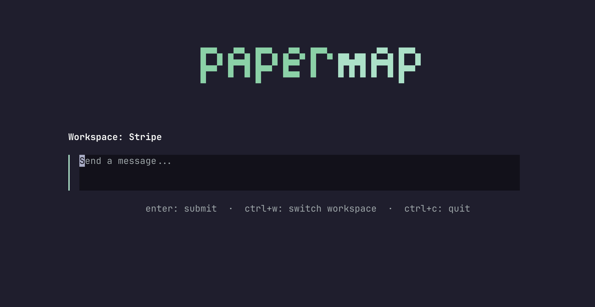

# Papermap TUI

[](https://github.com/papermap/papermap-tui/actions/workflows/build.yml)
[](https://github.com/papermap/papermap-tui/actions/workflows/release.yml)
[](https://pkg.go.dev/github.com/papermap/papermap-tui)
[](https://goreportcard.com/report/github.com/papermap/papermap-tui)

Terminal-native access to Papermap. Sign in, land in your unified workspace, ask questions, watch streamed insight responses render in your terminal.

Built with [Bubble Tea](https://github.com/charmbracelet/bubbletea), [Lipgloss](https://github.com/charmbracelet/lipgloss), [Glamour](https://github.com/charmbracelet/glamour), and [Huh](https://github.com/charmbracelet/huh).



## Install

### Install script (Linux / macOS)

```bash
curl -fsSL https://raw.githubusercontent.com/papermap/papermap-tui/main/install.sh | sh
```

The script downloads the latest release, verifies its SHA256 checksum, and installs to `/usr/local/bin` or `~/.local/bin`.

Override the install prefix or version:

```bash
PREFIX=$HOME/.local VERSION=v0.1.0 \
    curl -fsSL https://raw.githubusercontent.com/papermap/papermap-tui/main/install.sh | sh
```

### Go install

```bash
go install github.com/papermap/papermap-tui/cmd/papermap@latest
```

### From source

```bash
git clone https://github.com/papermap/papermap-tui.git
cd papermap-tui
make build
./bin/papermap
```

## Getting started

Sign in once, then launch the TUI:

```bash
papermap auth login
papermap
```

`auth login` writes credentials to `~/.papermap/credentials` (mode `0600`). Subsequent launches restore your session automatically and refresh tokens as needed.

## Usage

```text
papermap [flags] [command]
```

### Flags

| Flag                | Description                                                  |
| ------------------- | ------------------------------------------------------------ |
| `-v`, `--version`   | Print version, commit, and build date                        |
| `-h`, `--help`      | Show help                                                    |
| `-u`, `--user`      | Print the signed-in user (alias for `auth whoami`)           |
| `--api-url <url>`   | Override the API base URL for this run (sets `PAPERMAP_API_URL`) |

### Commands

| Command              | Description                                       |
| -------------------- | ------------------------------------------------- |
| _(none)_             | Launch the TUI                                    |
| `auth login`         | Sign in with email + password                     |
| `auth logout`        | Clear stored credentials and workspace cache      |
| `auth whoami`        | Print the currently signed-in user                |
| `logout`             | Deprecated alias for `auth logout`                |

### Keyboard controls

| Key       | Action                                  |
| --------- | --------------------------------------- |
| `Enter`   | Submit prompt / confirm                 |
| `Tab`     | Switch focus inside forms               |
| `Ctrl+W`  | Switch workspace                        |
| `Ctrl+L`  | Clear chat                              |
| `Esc`     | Cancel / go back                        |
| `Ctrl+C`  | Quit (with confirmation)                |

## Configuration

Configuration is loaded from `~/.papermap/config.yaml`. Environment variables take precedence.

| Setting   | Config key | Env var             | Default                            |
| --------- | ---------- | ------------------- | ---------------------------------- |
| API URL   | `api_url`  | `PAPERMAP_API_URL`  | `https://dataapi.papermap.ai`  |

Example `~/.papermap/config.yaml`:

```yaml
api_url: https://dataapi.papermap.ai
```

Point at the production API for one run:

```bash
papermap --api-url https://dataapi.papermap.ai
# or
PAPERMAP_API_URL=https://dataapi.papermap.ai papermap
```

## Development

```bash
make build              # build into ./bin/papermap
make run                # go run ./cmd/papermap
make test               # go test ./... -race
make fmt                # gofumpt + goimports
make lint               # golangci-lint run
make tidy               # go mod tidy
make hooks              # install repo git hooks (lint on commit)
make release-snapshot   # local goreleaser snapshot build
```

Project layout:

```text
cmd/papermap/        # CLI entry point + subcommand routing
internal/api/        # Backend HTTP client + SSE streaming
internal/auth/       # Token store and credential persistence
internal/cli/auth/   # `auth login|logout|whoami` huh forms
internal/config/     # Config + env loading
internal/theme/      # Lipgloss palette and shared styles
internal/ui/         # Bubble Tea screen models (landing/chat/workspace)
internal/app/        # Root app model and orchestration
```

## Releasing

Releases are produced by [GoReleaser](https://goreleaser.com) on tag pushes:

```bash
git tag v0.1.0
git push origin v0.1.0
```

The `release` workflow builds darwin/linux × amd64/arm64 archives, uploads them to GitHub Releases, and publishes a `checksums.txt` for the install script to verify against.

## License

See [LICENSE](LICENSE) if present in the repository root.
